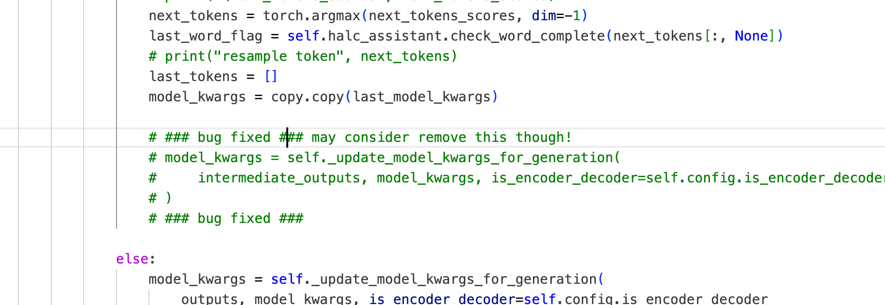
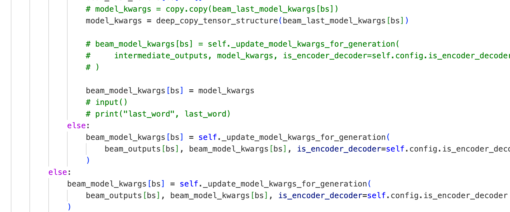
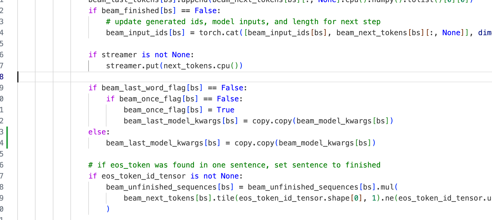

## Experiment Baselines

### COCO num_sample: 100

+ Greedy: 

    | SPICE | METEOR | CIDEr | CHAIRs | CHAIRi |
    |-------|--------|-------|--------|--------|
    | 21.9  | 28.2   | 77.4  | 14.7   | 8.9    |

+ DoLA: 

    | SPICE | METEOR | CIDEr | CHAIRs | CHAIRi |
    |-------|--------|-------|--------|--------|
    | 22.3  | 28.2   | 74.4  | 14.7   | 9.0    |

+ HaLC+DoLA:

    | SPICE | METEOR | CIDEr | CHAIRs | CHAIRi |
    |-------|--------|-------|--------|--------|
    | 21.5  | 28.1   | 67.3  | 14.0   | 8.0    |

+ HaLC+Beam:

    | SPICE | METEOR | CIDEr | CHAIRs | CHAIRi |
    |-------|--------|-------|--------|--------|
    | 21.5  | 28.1   | 67.3  | 14.0   | 8.0    |

### COCO num_sample: 200

+ Greedy: 

    | SPICE | METEOR | CIDEr | CHAIRs | CHAIRi |
    |-------|--------|-------|--------|--------|
    | 20.7  | 26.5   | 58.1  | 14.2   | 8.4    |

+ DoLA: 

    | SPICE | METEOR | CIDEr | CHAIRs | CHAIRi |
    |-------|--------|-------|--------|--------|
    | 20.7  | 26.5   | 56.8  | 13.8   | 8.1    |

+ HaLC+DoLA:

    | SPICE | METEOR | CIDEr | CHAIRs | CHAIRi |
    |-------|--------|-------|--------|--------|
    | 19.7  | 25.2   | 50.7  | 15.5   | 9.8    |

+ HaLC+Beam:

    | SPICE | METEOR | CIDEr | CHAIRs | CHAIRi |
    |-------|--------|-------|--------|--------|
    | 21.2  | 26.7   | 59.5  | 12.0   | 7.7    |

### COCO num_sample: 500

+ Greedy: 

    | SPICE | METEOR | CIDEr | CHAIRs | CHAIRi |
    |-------|--------|-------|--------|--------|
    | 20.7  | 26.5   | 58.1  | 14.2   | 8.4    |

+ DoLA: 

    | SPICE | METEOR | CIDEr | CHAIRs | CHAIRi |
    |-------|--------|-------|--------|--------|
    | 20.7  | 26.5   | 56.8  | 13.8   | 8.1    |

+ HaLC+DoLA:

    | SPICE | METEOR | CIDEr | CHAIRs | CHAIRi |
    |-------|--------|-------|--------|--------|
    | 19.9  | 25.5   | 52.0  | 12.4   | 7.5    |

### COCO num_sample: 300

+ Greedy: 

    | SPICE | METEOR | CIDEr | CHAIRs | CHAIRi |
    |-------|--------|-------|--------|--------|
    | 20.7  | 26.5   | 58.1  | 14.2   | 8.4    |

+ DoLA: 

    | SPICE | METEOR | CIDEr | CHAIRs | CHAIRi |
    |-------|--------|-------|--------|--------|
    | 20.9  | 26.8   | 55.4  | 11.7   | 7.2    |

+ HaLC+DoLA:

    | SPICE | METEOR | CIDEr | CHAIRs | CHAIRi |
    |-------|--------|-------|--------|--------|
    | 21.8  | 27.7   | 64.7  | 9.7   | 5.9    |

### COCO num_sample: 3000

+ Greedy: 

    | SPICE | METEOR | CIDEr | CHAIRs | CHAIRi |
    |-------|--------|-------|--------|--------|
    | 20.3  | 26.2   | 57.6  | 13.1   | 9.0    |

+ DoLA: 

    | SPICE | METEOR | CIDEr | CHAIRs | CHAIRi |
    |-------|--------|-------|--------|--------|
    | 20.8  | 26.6   | 55.8  | 12.9   | 8.7    |

+ HaLC+DoLA:

    | SPICE | METEOR | CIDEr | CHAIRs | CHAIRi |
    |-------|--------|-------|--------|--------|
    | 19.8  | 25.6   | 52.7  | 12.8   | 8.2    |

### Experiment 12/25

still running:

+ HaLC+DoLA 500: 

+ HaLC+Beam 100:

    | SPICE | METEOR | CIDEr | CHAIRs | CHAIRi |
    |-------|--------|-------|--------|--------|
    | 21.7  | 28.3   | 71.5  | 16.0   | 9.2    |